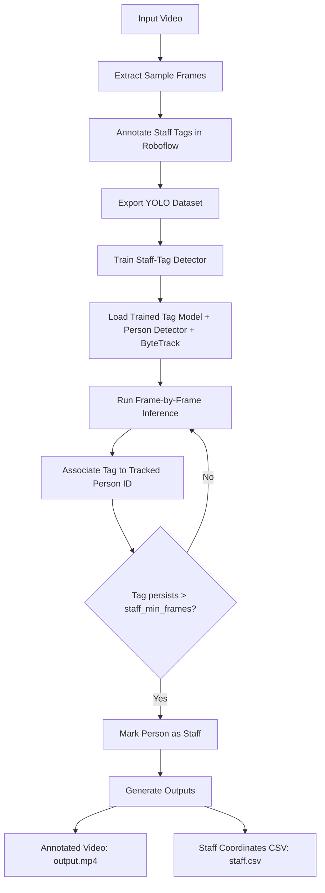

# Staff Tag Detection

Detect and localize staff members in video by combining:

- a custom YOLO model to detect `staff-tag`
- a person detector with ByteTrack tracking IDs
- temporal association logic that marks a tracked person as staff only after consistent evidence across frames

This repository includes an end-to-end notebook pipeline (`main.ipynb`) and script entry points in `scripts/`.

## Problem Statement

Given a video stream, identify which detected people are staff members based on visible staff tags, then export:

- an annotated output video
- a timestamped coordinate log of staff positions

The design goal is to reduce false positives from one-off detections by requiring tag-to-person consistency over multiple frames.

## High-Level Pipeline



## Decision Rule (Core Logic)

A tracked person is labeled as staff only when all conditions hold:

1. Tag detection confidence is above `tag_conf` (default `0.2`).
2. Tag center lies inside that tracked person's bounding box.
3. This association persists for more than `staff_min_frames` (default `5`).

This temporal filter improves stability compared to per-frame classification.

## Repository Structure

- `main.ipynb` - end-to-end workflow (frame extraction, dataset download, training, inference)
- `scripts/extract_frames.py` - sample frames from input video for labeling
- `scripts/train_tag_model.py` - fine-tune YOLO tag detector
- `scripts/run_inference.py` - run detection, tracking, association, and export outputs
- `config.yaml` - default paths and thresholds
- `staff-tag-detection-1/` - Roboflow YOLO dataset export
- `output/output.mp4` - annotated output video (generated)
- `output/staff.csv` - timestamp and coordinates of detected staff (generated)

## Setup

### 1) Create and activate virtual environment

```bash
python3 -m venv .venv
source .venv/bin/activate
```

### 2) Install dependencies

```bash
pip install -r requirements.txt
```

### 3) Configure environment variable (for Roboflow download step)

```bash
cp .env.example .env
export ROBOFLOW_API_KEY="your_real_key"
```

## Reproducible Run

### Option A: Notebook (recommended for walkthrough)

Run `main.ipynb` top-to-bottom.

### Option B: Scripts

```bash
python3 scripts/extract_frames.py
python3 scripts/train_tag_model.py
python3 scripts/run_inference.py
```

Defaults are aligned with `config.yaml`.

## Configuration

Primary defaults in `config.yaml`:

- `thresholds.person_conf`: `0.2`
- `thresholds.tag_conf`: `0.2`
- `thresholds.staff_min_frames`: `5`
- `training.epochs`: `50`
- `training.imgsz`: `640`
- `training.device`: `cpu`

## Outputs

### 1) Annotated video

- File: `output/output.mp4`
- Includes detected tag boxes and staff-labeled person boxes.

### 2) Staff coordinate log

- File: `output/staff.csv`
- Columns:
  - `timestamp` (`MM:SS`)
  - `x` (staff person bbox center x)
  - `y` (staff person bbox center y)
  - `person_conf` (person detector confidence)

## Design Choices and Tradeoffs

- **YOLO for tag detection:** fast and practical for small-object detection after task-specific fine-tuning.
- **ByteTrack for identity persistence:** keeps person IDs stable enough for temporal association.
- **Temporal thresholding (`staff_min_frames`):** lowers false positives from noisy single-frame tag detections.

Tradeoffs:

- Small or occluded tags can be missed.
- ID switches can occur under heavy crowding/occlusion.
- CPU inference is portable but slower than GPU deployment.

## Known Failure Modes

- Motion blur reduces tag confidence.
- Partial body visibility can break tag-to-person association.
- Dense scenes can increase tracking ID switches.
- Very small tags at distance may not pass confidence thresholds.

## Troubleshooting

- **No output video generated**
  - Verify `video/sample.mp4` exists and is readable by OpenCV.
- **Model file not found**
  - Ensure training produced `runs/detect/train/weights/best.pt`.
- **Empty CSV output**
  - Lower confidence thresholds or reduce `staff_min_frames`.
- **Slow runtime**
  - Use GPU (`training.device`) when available.
